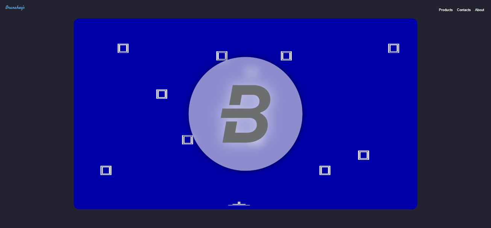

# Branchey's

Welcome to the archive repository for this website! I created the project in January 2022 as my initial dive into the world of web development. It's a simple, static site built for a concept I called "Branchey's".

While not polished or advanced, this project represents an important first step in my programming journey.

> **Note:** This project has been modified slightly to make it hostable. You can find the original, unmodified version in the [`original`](https://github.com/branislavjuhaas/brancheys/tree/original) branch.

## About This Project

This website was a learning exercise to understand the basics of HTML, CSS, and JavaScript. The concept was a small software company with a mission to make programming accessible and to develop for classic platforms like MS-DOS.

The site includes several pages:

- **[Home](source/index.html)**: The main landing page featuring a simple image carousel.
- **[Products](source/subpages/products.html)**: A page showcasing fictional products with a dynamic description area.
- **[About](source/subpages/about.html)**: Information about the fictional "Branchey's" company.
- **[Contacts](source/subpages/contacts.html)**: A basic contact information page.

## Technologies Used

This project was built from the ground up using fundamental web technologies:

- HTML5
- CSS3
- Vanilla JavaScript

## How to View

To see the website in action, you can open the [`source/index.html`](source/index.html) file directly in your web browser.

## License

This project is licensed under the MIT License. See the [LICENSE](LICENSE) file for details.
